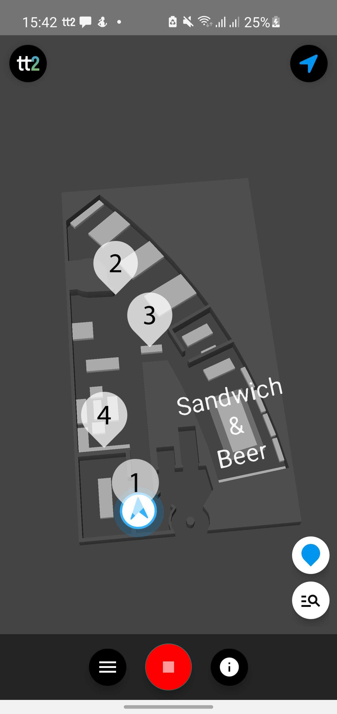

# TT2 SDK

The TT2 SDK provides a powerful indoor positioning system that doesn’t need any external hardware. It contains tools for
accurate live positioning, position based analytics, interactive and customizable map, zone based messages and more. 

# Getting started

- [Requirements](#requirements)
- [Supported platforms](#supported-platforms)
- [Platform Overview](#platform-overview)
- [Code samples](#supported-platforms)
- [Documentation](#supported-platforms)

# Requirements

Check platform specific requirements for details.

# Platform Overview

The TT2 SDK consists of two `Passive`(**TT2**) and`Active`(**Map**) parts. You can use the `Passive` part without using
the `Active` but it is not possible to do that in reverse.

# Supported platforms

| Platform  | Description | Get started | Code Samples | Documentation
|     :---:      |     :---:      |     :---:      |     :---:      |     :---:      |
| Android  | TT2 Android SDK  |  | |  |
| iOS   | TT2 iOS SDK   |   |  |  |
