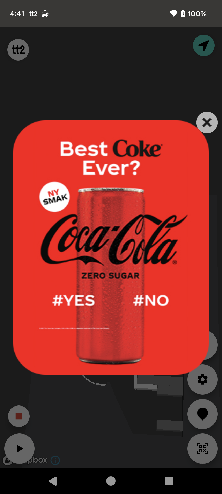
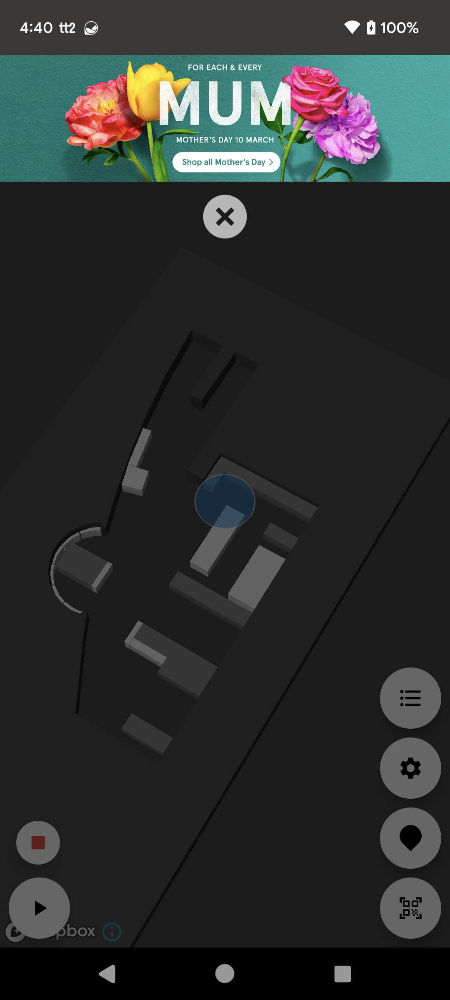

---
# Feel free to add content and custom Front Matter to this file.
# To modify the layout, see https://jekyllrb.com/docs/themes/#overriding-theme-defaults

layout: default
description: Guide to Location-Based Communication.
---

# Location-Based Communication
### Table of Contents
- [Location-Based Communication](#location-based-communication)
    - [Table of Contents](#table-of-contents)
  - [Quick start](#quick-start)
  - [Manage Trigger events manually](#manage-trigger-events-manually)
  - [Create trigger events with the SDK](#create-trigger-events-with-the-sdk)

## Quick start
The TriggerEventController handles the controls for location based trigger events and you can use this to create location based triggers to ie. show a message to the user. The TriggerEventController also handles location-based messages created in the CMS.

For image based messages the TriggerEventController can be set to automatically display the image on top of the application ui, either as a centered large image or a banner located in the top of the screen.




<br/><br/>
When using auto show the SDK will manage which message to be shown, make sure its only shown once per visit and report to tt2 analytics to track message views.

To activate auto show: 
```kotlin
import se.virtualstores.tt2.androidsdk.Listener

class ExampleActivity : AppCompatActivity() {

    fun afterStoreInit() {
        // to enable auto show for image based messages
        TT2.triggerEvents.enableAutoShow(true, this)
    }
}
```


You can also register a listener for the trigger event and manually handle the events.


<br/><br/>


## Manage Trigger events manually
Trigger events can be created in the TT2 CMS or via the SDK. 
Trigger events are mostly set to trigger on user locaton, when entering/exiting a specific area or radius.

The trigger event controller can be accessed after store initiation by calling: `TT2.triggerEvents`

To listen for these events implement TriggerEventController.Listener interface and set the listener in TT2 after initiating the store.

```kotlin
import se.virtualstores.tt2.androidsdk.Listener

class ExampleActivity : AppCompatActivity(), TriggerEventController.Listener {

    fun afterStoreInit() {

        // to register your listener for trigger events for manual event management
        TT2.triggerEvents.setTriggerListener(this)
    }

    // Events triggered by the user location notifies the listener of the TriggerEvent.
    override fun onNewTriggerEvent(triggerEvent: TriggerEvent) {
        // handle the event
    }
}
```


The event data in the TriggerEvent can be found in its `metaData` field which is a `Map<String, String>`. Events created in the CMS has predefined keys for the values and is accessable through the TriggerEvent companion object.

```kotlin
    TriggerEvent.defaultMetaData.id // The id of the event
    TriggerEvent.defaultMetaData.type // The type of the event, SMALL or LARGE.
    TriggerEvent.defaultMetaData.imageUrl // The imageUrl of the message
```

Most commonly the messages that is created in the CMS only consists of an imageUrl to a specific promotion image to be displayed in a large image view on the screen. That way you wont have to create specific views to handle different styles of messages. 

```kotlin

override fun onNewTriggerEvent(triggerEvent: TriggerEvent) {
    
    // parse the trigger event to show it to the user. I.e in the event of an 
    // message event created in the CMS the event will contain the following metaData tags: 
        triggerEvent.metaData[TriggerEvent.defaultMetaData.id]?.let {
        
        }

        triggerEvent.metaData[TriggerEvent.defaultMetaData.type]?.let {
        
        }

        triggerEvent.metaData[TriggerEvent.defaultMetaData.imageUrl]?.let {
            
        }
}

```


```kotlin

override fun onNewTriggerEvent(triggerEvent: TriggerEvent) {
    
    // after receiving an event you can optionally remove it to avoid trigger it again during this visit
    // if the event was shown to the user it is recommended to remove it to avoid it again.
    TT2.triggerEvents.removeTriggerEvent(triggerEvent)


    // If the event is shown to the user then we recommend that that you also post the trigger event to 
    // the anlaytics.
    TT2.analytics.postEventData(triggerEvent.toMessageShownEvent())
}

```

## Create trigger events with the SDK
In addition to creating trigger events in the CMS Trigger events can also be created added directly during runtime.
This is useful if you already have a sofisticated service for personal discounts or other information channels that you want to trigger based on the user location.

TriggerEvents created and added to the SDK will not appear in the CMS(currently). Since this is intended to be used with exsisting services the tracking of analytics should be reported back to the service instead of reporting it to tt2 analytics.


Setup trigger events by adding them to the trigger controller.
In this example shows the creation of an image based trigger event that will trigger when a user enters the `dairy` zone.

```kotlin
val triggerEvent = TriggerEvent.Builder()
    .addTags(
        listOf(
            TriggerEvent.defaultTags.displayType to TriggerEvent.DefaultTags.DisplayType.IMAGE.name,
            TriggerEvent.defaultTags.id to "something that identifies the message",
        )
    )
    .addMetaData(
        listOf(
            TriggerEvent.defaultMetaData.imageUrl to "https://image-url.png",
            "CustomKey" to "custom data in string format"
        )
    )
    .setTriggerEventData(
        TriggerEventType.ZonesTrigger(
            listOf(
                TriggerEventType.ZonesTrigger.ZoneTrigger(
                    "dairy",
                    TriggerEventType.ZonesTrigger.ZoneTrigger.Type.ENTER
                )
            )
        )
    )
    .build()

TT2.triggerEvents.addTriggerEvent(triggerEvent)

```