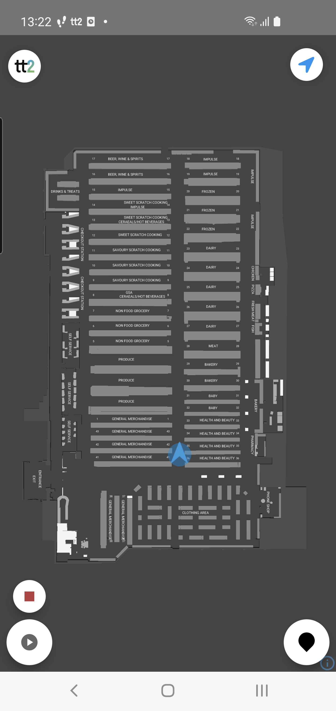
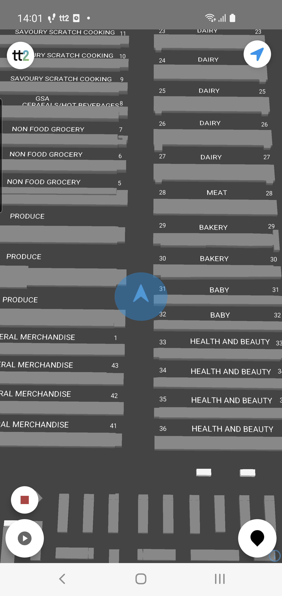
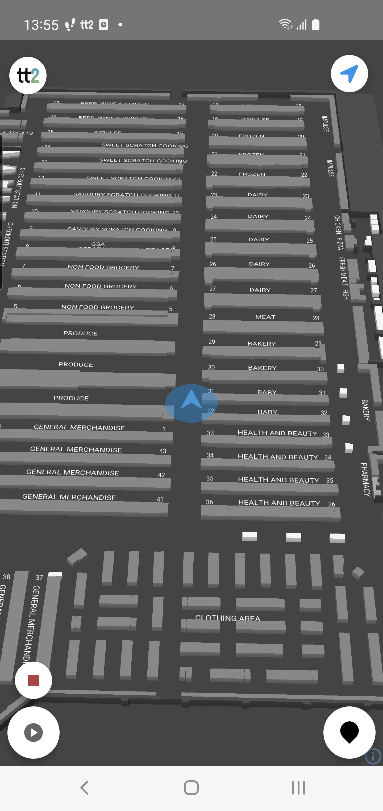

---
# Feel free to add content and custom Front Matter to this file.
# To modify the layout, see https://jekyllrb.com/docs/themes/#overriding-theme-defaults

layout: default
description: Guide to TT2 Android CameraController.
---

# Camera Controller
### Table of Contents
- [Camera Controller](#camera-controller)
    - [Table of Contents](#table-of-contents)
  - [Summary](#summary)
  - [Camera modes:](#camera-modes)
    - [ContainMap2D](#containmap2d)
    - [FollowUser3D](#followuser3d)
    - [CameraAutoReset](#cameraautoreset)

## Summary
The CameraController handles the controls for the camera modes in the map view.

Documentation: [CameraController](https://virtualstores.github.io/tt2/android/tt2-domain/se.virtualstores.tt2_domain.map/-camera-controller/index.html)

Documetation: [CameraModes](https://virtualstores.github.io/tt2/android/tt2-domain/se.virtualstores.tt2_domain.map/-camera-controller/-camera-modes/index.html)
<br/><br/>

## Camera modes:

<br/>

### ContainMap2D



Example:
```kotlin

class MyMapFragment: Fragment(), MapListener {
    
    var mapController: MapController? = null

    override fun onViewCreated(view: View, savedInstanceState: Bundle?) {
        super.onViewCreated(view, savedInstanceState)

        mapController = BaseMapController(
            binding.mapView,
            MapOptions())

        mapController.mapListener = this
        TT2.setMapController(mapController)
    }

    // the map is now fully loaded and it's now safe to start using it
    override fun onMapLoaded() {
        super.onMapLoaded()
        mapController.camera.updateCameraMode(mapController.camera.modes.containMap2D())
    } 
```
<br/><br/>

### FollowUser3D




Example:
```kotlin

class MyMapFragment: Fragment(), MapListener {
    
    var mapController: MapController? = null

    override fun onViewCreated(view: View, savedInstanceState: Bundle?) {
        super.onViewCreated(view, savedInstanceState)

        mapController = BaseMapController(
            binding.mapView,
            MapOptions())

        mapController.mapListener = this
        TT2.setMapController(mapController)
    }

    // the map is now fully loaded and it's now safe to start using it
    override fun onMapLoaded() {
        super.onMapLoaded()

        // Image 1 default zoom=7.5 and tilt=25.0
        mapController.camera.updateCameraMode(mapController.camera.modes.followUser3D())

        // Image 2 setting zoom and tilt to custom values
        mapController.camera.updateCameraMode(mapController.camera.modes.followUser3D(zoom = 7.0, tilt = 45.0))
    } 
```
<br/><br/>

### CameraAutoReset
Setting this value in the camera will automatically reset to the last camera mode after x amount of milliseconds passed in to the function.

Docs: [`setAutoCameraResetDelay(delay: Long)`](https://virtualstores.github.io/tt2/android/tt2-domain/se.virtualstores.tt2_domain.map/-camera-controller/index.html#-1588215429%2FFunctions%2F-1461421708)

<video  height="500" preload="auto" controls autoplay muted loop>
  <source src="../../res/android/cameracontroller/containMap2DcameraReset.mp4" type="video/mp4">
</video>
<video  height="500" preload="auto" controls autoplay muted loop>
  <source src="../../res/android/cameracontroller/followUser3DcameraReset.mp4" type="video/mp4">
</video>

```kotlin

class MyMapFragment: Fragment(), MapListener {
    
    var mapController: MapController? = null

    override fun onViewCreated(view: View, savedInstanceState: Bundle?) {
        super.onViewCreated(view, savedInstanceState)

        mapController = BaseMapController(
            binding.mapView,
            MapOptions())

        mapController.mapListener = this
        TT2.setMapController(mapController)
    }

    // the map is now fully loaded and it's now safe to start using it
    override fun onMapLoaded() {
        super.onMapLoaded()
        // reset delay in millis
        mMapController.camera.setAutoCameraResetDelay(4000)
    } 
```