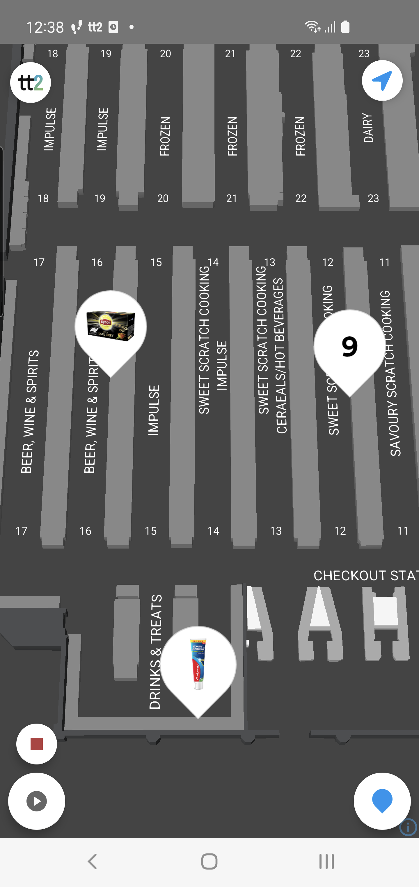
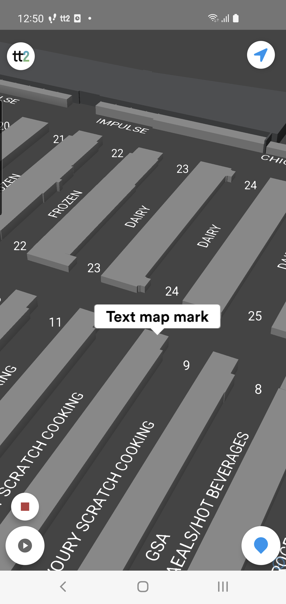

---
# Feel free to add content and custom Front Matter to this file.
# To modify the layout, see https://jekyllrb.com/docs/themes/#overriding-theme-defaults

layout: default
description: Guide to TT2 Android MarkerController.
---

# Camera Controller
### Table of Contents
- [Camera Controller](#camera-controller)
    - [Table of Contents](#table-of-contents)
  - [Summary](#summary)
  - [MarkerController](#markercontroller)

## Summary
The MarkerController handles the controls for map marks in the map view.

Documentation: [MarkerController](https://virtualstores.github.io/tt2/android/tt2-domain/se.virtualstores.tt2_domain.map/-marker-controller/index.html)




<br/><br/>

## MarkerController

Example:
```kotlin
// Implement interface MarkerController.Listener
class MyMapFragment: Fragment(), MapListener, MarkerController.Listener {
    
    // the map is now fully loaded and it's now safe to start using it
    override fun onMapLoaded() {
        super.onMapLoaded()
        
        mapController.marker.addListener(this)
    }

    // using map marks
    fun addMarkToMap(data: YourData, itemPosition: IItemPosition) {
        // the BaseMapMark class that are available in the SDK can show two different types of information, image or text
        // You can design your own map marks by extending :MapMark<T>, Comparable<MapMark<T>>
        val mark = BaseMapMark(
            id = data.shelfId,
            position = itemPosition.point,
            floorLevelId = itemPosition.floorLevelId,
            data = data,
            // choose either mark with image:
            imageURL = data.imageUrl,
            // or mark with text:
            text = data.label
        )

        mapController.marker.addMark(mark)
    }

        
    override fun onMarkClick(mark: MapMark<out Any>) {
        (mark.data as? YourData)?.let {

        }
    }

    override fun onClusterClicked(marks: List<MapMark<out Any>>) {

    }

    override fun onMarkTriggerEnter(mark: MapMark<out Any>) {
        
    }

    override fun onMarkTriggerExit(mark: MapMark<out Any>) {
        
    }

```
<br/><br/>