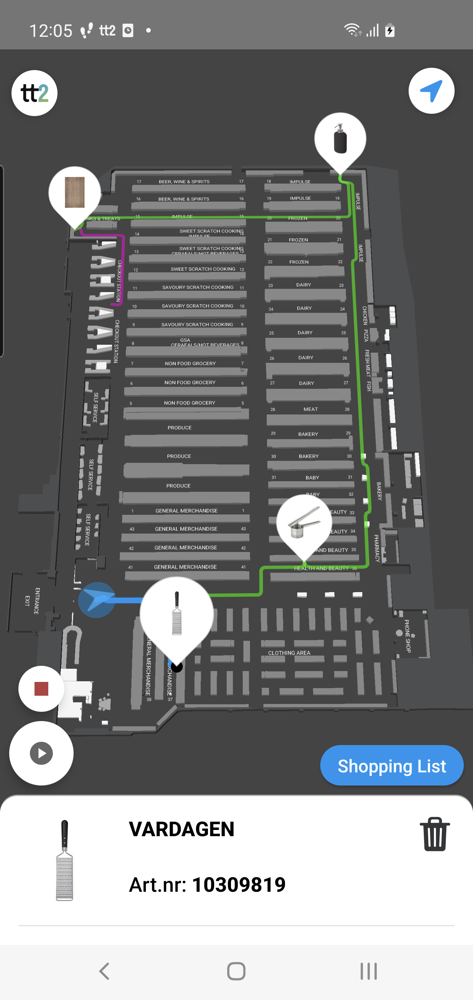
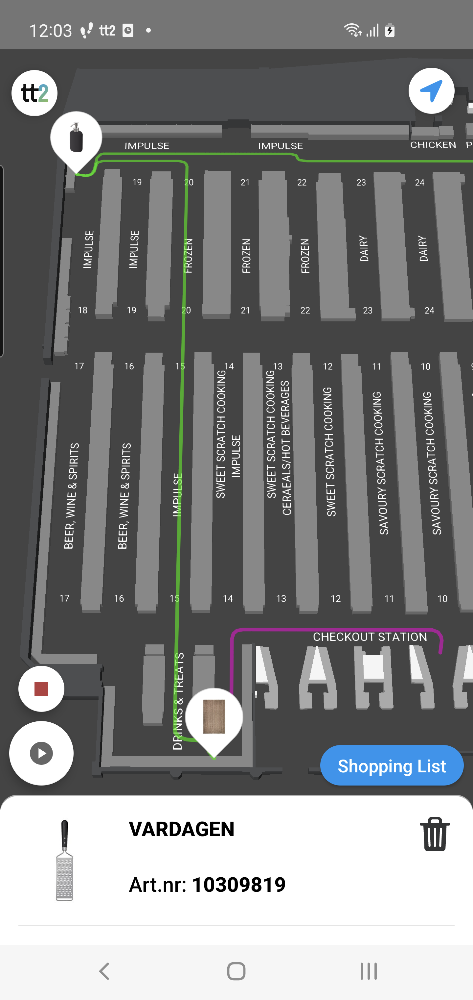
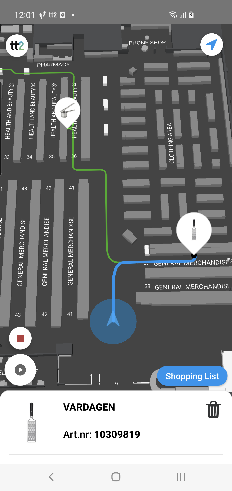
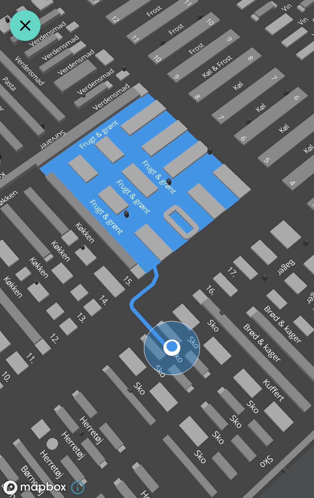

---
# Feel free to add content and custom Front Matter to this file.
# To modify the layout, see https://jekyllrb.com/docs/themes/#overriding-theme-defaults

layout: default
description: Guide to TT2 Android PathfindingController.
---

# Pathfinding Controller
### Table of Contents
- [Pathfinding Controller](#pathfinding-controller)
    - [Table of Contents](#table-of-contents)
  - [Summary](#summary)
    - [PathfindingController](#pathfindingcontroller)
    - [Controlling the path components:](#controlling-the-path-components)
    - [Serach for Zones](#serach-for-zones)

## Summary
Documentation: [PathfindingController](https://virtualstores.github.io/tt2/android/tt2-domain/se.virtualstores.tt2_domain.map/-pathfinding-controller/index.html)

Documentation: [BasePathfindingGoal](https://virtualstores.github.io/tt2/android/lib-map/se.virtualstores.lib_map.pub.model.pathfinding/-base-pathfinding-goal/index.html)

The PathfinderController handles the controls for pathfinding to one or several goals on the map.
The common usecase is to use the Pathfinder together with the MarkerController when helping the end user to navigate to a specific item/location. One would then create and place a mark on the item/location position and also create and add a goal on the same position. 

Multiple goals can be added to the pathfinder which will then calculate the shortest route for to each goal and in an order that will result in the shortest overall distance to cover all goals.

In order for the pathfinder to create the optimal route for all goals it uses it's start & end position to know where the end user should end up efter visiting all placed goals. The Start- and EndPosition is set in the CMS.

The calculated path is split into three different components, Head, Body and Tail:
 - Head: The path from the current user position to the current goal.
 - Body: The path from and betwen the current goal and all remaining goals.
 - Tail: The path from the last goal to the pathfinder EndPosition.

The image below shows the different path components. Head=blue, Body=green and Tail=pink





<br/><br/>

Each path component can be styled independently by overriding the default Pathfinder settings in the MapOptions when setting up the MapController.

Each path component has its own layer and can be switched off with the methods provided by the PathfinderController.


### PathfindingController


Example:
```kotlin
// Implement interface PathfindingController.Listener
class MyMapFragment: Fragment(), MapListener, PathfindingController.Listener {
    
    var mapController: MapController? = null

    override fun onViewCreated(view: View, savedInstanceState: Bundle?) {
        super.onViewCreated(view, savedInstanceState)

        val mapOptions = MapOptions().apply {
            pathStyle = MapOptions.PathStyle().apply {

                head = MapOptions.LineStyle(
                    lineColor = requireContext().getColor(R.color.colorPathfindingHead),
                    lineWidth = 5.0f,
                    lineOpacity = 1.0f,
                )

                body = MapOptions.LineStyle(
                    lineColor = requireContext().getColor(R.color.colorPathfindingBody),
                    lineWidth = 3.0f,
                    lineOpacity = 0.6f,
                )
                tail = MapOptions.LineStyle(
                    lineColor = requireContext().getColor(R.color.colorPathfindingTail),
                    lineWidth = 3.0f,
                    lineOpacity = 0.6f,
                )
            }
        }

        mapController = BaseMapController(
            binding.mapView,
            mapOptions)

        mapController.mapListener = this
        TT2.setMapController(mapController)
    }


    // the map is now fully loaded and it's now safe to start using it
    override fun onMapLoaded() {
        super.onMapLoaded()

        mapController.pathfinder.addListener(this)
    }

    // Using the pathfinder 
    fun addPathfinderGoalToMap(data: AnyDataClass, itemPosition: IItemPosition) {        
        val goal = BasePathfindingGoal(
            id = data.id,
            position =  itemPosition.point,
            floorLevelId = itemPosition.floorLevelId,
            data = data
        )

        mapController.pathfinding.addGoal(goal)
    }

    // listening for pathfinder updates
    override val pathfindingListenerId: String
        get() = <choose an id for this listener>

    override fun onCurrentGoalChange(goal: PathfindingController.PathfindingGoal<out Any>?) {
         (goal.data as? AnyDataClass)?.let {
            
        }   
    }

    override fun onSortedGoalChange(goals: List<PathfindingController.PathfindingGoal<out Any>>) {
            
    }

    
```

<br/>

### Controlling the path components:
```kotlin
// Implement interface PathfindingController.Listener
class MyMapFragment: Fragment(), MapListener, PathfindingController.Listener {
    
    // the map is now fully loaded and it's now safe to start using it
    override fun onMapLoaded() {
        super.onMapLoaded()
        mapController.pathfinder.addListener(this)
        
        // Show the pathfinding components 
        mapController.pathfinding.showPathfinding()
        
        // Hide the pathfinding components 
        mapController.pathfinding.hidePathfinding()

        // Hide specific pathfinding components 
        mapController.pathfinding.hideTail()
        mapController.pathfinding.hideBody()
        mapController.pathfinding.hideHead()

        // Show specific pathfinding components 
        mapController.pathfinding.showTail()
        mapController.pathfinding.showBody()
        mapController.pathfinding.showHead()

    }
    
```

### Serach for Zones

If you want to guide a user to a specific zone you can do so by adding the ZonesController into the mix.



Example:
```kotlin
// Implement interface PathfindingController.Listener
class MyMapFragment: Fragment(), MapListener, PathfindingController.Listener {
    
    ...

    // Using the pathfinder to to a zone
    fun addPathfinderGoalToMap(data: AnyDataClass, zonePosition: ZonePosition) {        
        
        // Setup the desired zone layer visibility, i.e only showing the fill layer (like in the example image above)
        mapController?.zones?.showFillLayer()
        mapController?.zones?.hideLineLayer()
        mapController?.zones?.hideTextLayer()

        // Makes sure that the only zones visible are the ones we are searching for.
        mapController?.zones?.hideAll()
        mapController?.zones?.deselectAll()


        val goal = BasePathfindingGoal(
            id = data.id,
            position =  zonePosition.point,
            floorLevelId = zonePosition.floorLevelId,
            data = data,
            zoneId = zonePosition.id
        )

        mapController.pathfinding.addGoal(goal)

        // use the zoneController to highlight the zone.

        mapController.zones?.show(zonePosition.id)
        mapController.zones?.select(zonePosition.id)

    }

    // listening for pathfinder updates
    override val pathfindingListenerId: String
        get() = <choose an id for this listener>

    override fun onCurrentGoalChange(goal: PathfindingController.PathfindingGoal<out Any>?) {
         (goal.data as? AnyDataClass)?.let {
            
        }   
    }

    override fun onSortedGoalChange(goals: List<PathfindingController.PathfindingGoal<out Any>>) {
            
    }

    
```