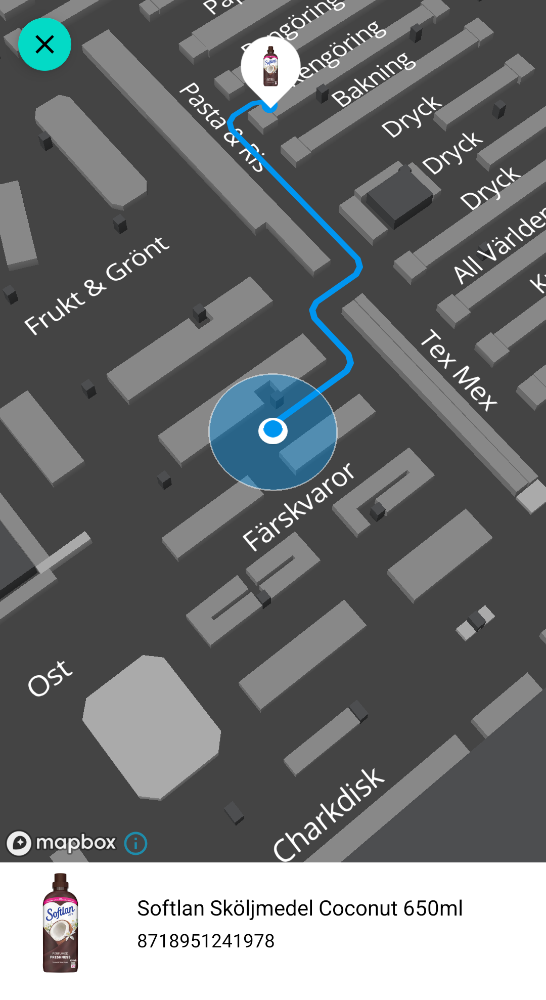
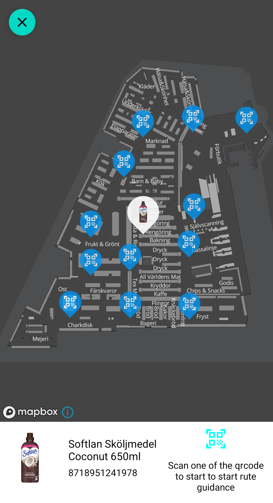

---
# Feel free to add content and custom Front Matter to this file.
# To modify the layout, see https://jekyllrb.com/docs/themes/#overriding-theme-defaults

layout: default
description: This use case shows the TT2 integration flow for a Scan & Go moblie app.
---

# Use case Single Item WayFinding
### Table of Contents
- [Use case Single Item WayFinding](#use-case-single-item-wayfinding)
    - [Table of Contents](#table-of-contents)
  - [Overview](#overview)
  - [UI Presets](#ui-presets)
  - [Setting the UIPreset in BaseMapController](#setting-the-uipreset-in-basemapcontroller)
- [Example](#example)

## Overview
Use this if you want TT2 Map to use a predetermined way of how to handle the map when wayfinding to a single item.


## UI Presets
The `BaseMapController` can be initiated with different `UIPreset` options that automatically will control specific behaviours of the map based on certain events.

This section will cover the `StateOptions.UIPreset.SINGLE_ITEM_WAY_FINDING` preset.

## Setting the UIPreset in BaseMapController

When creating the BaseMapController you can set the `stateOptions` parameter to set the desired UIPreset.

```kotlin
BaseMapController(
    mapView = binding.mapView,
    options = MapOptions(),
    stateOptions = StateOptions(
        uiPresets = StateOptions.UIPreset.SINGLE_ITEM_WAY_FINDING,
    ),
    listener = this,
)
```

The `BaseMapController.Listener` provides updates on the current state of the map.

```kotlin
override fun onMapStateChange(state: MapStateMachine.State) {
    when (state) {
        MapStateMachine.State.PENDING -> {
            
        }

        MapStateMachine.State.LOCATION_UNKNOWN -> {
            
        }

        MapStateMachine.State.LOCATION_KNOWN -> {
            
        }
    }
}
```

Depending on which state you may want display different information to the user.

Example: when `state == MapStateMachine.State.LOCATION_UNKNOWN` inform user how to get a known location by scanning one of the positioned qr-codes located throughout the venue. 




<br>
<br>

# Example 
Using a fragment to display route guidance to an item using UIPreset.SINGLE_ITEM_WAY_FINDING

This example assumes that the itemPosition of the item you want to wayfind to is already known and residing in the ViewModel along with the item.

In `onViewCreated()` we create a MapController using the included BaseMapController. We set the StateOptions to use `StateOptions.UIPreset.SINGLE_ITEM_WAY_FINDING` and add ourselves as both the BaseMapController.Listener as well as MapListener to receive both `onMapStateChange(state)` and most importantly the `onMapLoaded()` indicating that we start using the MapController.

In `onMapLoaded()` we create both a MapMark and a PathfinderGoal for the item using the itemPosition. We then set the MapMark and PathfinderGoal in respective controller.


```kotlin
class WayFindingMapFragment : Fragment(), MapListener, BaseMapController.Listener {

    private lateinit var binding: FragmentMapWayfindingBinding
    private val viewModel: WayFindingActivityViewModel by activityViewModels()
    private var mapController: MapController? = null

    override fun onCreateView(
        inflater: LayoutInflater,
        container: ViewGroup?,
        savedInstanceState: Bundle?,
    ): View? {
        binding =
            FragmentMapWayfindingBinding.inflate(
                LayoutInflater.from(requireContext()),
                container,
                false
            )

        return binding.root
    }


    override fun onViewCreated(view: View, savedInstanceState: Bundle?) {
        super.onViewCreated(view, savedInstanceState)

        mapController = BaseMapController(
            mapView = binding.mapView,
            options = MapOptions(),
            stateOptions = StateOptions(
                uiPresets = StateOptions.UIPreset.SINGLE_ITEM_WAY_FINDING,
                controlStartScanLocationVisibility = true
            ),
            listener = this,
        )

        mapController?.mapListener = this
        
        TT2.setMapController(mapController)
    }


    override fun onMapLoaded() {
        // The map is loaded and ready
        viewModel.selectedItem?.let { item ->
            viewModel.selectedItemPosition?.let { itemPosition ->
                setMarkOnMap(item, itemPosition)
                setPathfinderGoalOnMap(item, itemPosition)
            }
        }
    }

    private fun setMarkOnMap(item: MyItem, itemPosition: IItemPosition) {
        mapController?.marker?.setMarks(
            listOf(
                BaseMapMark<MyItem>(
                    id = item.id,
                    position = itemPosition.point,
                    floorLevelId = itemPosition.floorLevelId,
                    data = item,
                    imageURL = item.imageUrl,
                    isFocused = false,
                )
            )
        )
    }

    private fun setPathfinderGoalOnMap(item: MyItem, itemPosition: IItemPosition) {
        mapController?.pathfinding?.setGoals(
            listOf(
                BasePathfindingGoal<MyItem>(
                    id = item.id,
                    position = itemPosition.point,
                    floorLevelId = itemPosition.floorLevelId,
                    data = item
                )
            )
        )
    }

    override fun onMapStateChange(state: MapStateMachine.State) {
        when (state) {
            MapStateMachine.State.PENDING -> {
                // Waiting for a pathfinder goal
            }

            MapStateMachine.State.LOCATION_UNKNOWN -> {
                // The pathfinder has a goal but the user location is unkown
                // The the map shows the Item location and the location of all qr-code locations.
            }

            MapStateMachine.State.LOCATION_KNOWN -> {
                // The pathfinder has a goal, the user location is known
                // The the map shows the route from the user location to the item location.
            }
        }
    }

    // Lifecycle callbacks for map controller
    override fun onStart() {
        mapController?.onStart()
        super.onStart()
    }

    override fun onStop() {
        mapController?.onStop()
        super.onStop()
    }

    override fun onLowMemory() {
        mapController?.onLowMemory()
        super.onLowMemory()
    }

    override fun onDestroyView() {
        mapController?.onDestroy()
        super.onDestroyView()
    }

    override fun onDestroy() {
        super.onDestroy()
    }
}
```
Fragment xml layout

```xml
<?xml version="1.0" encoding="utf-8"?>
<androidx.constraintlayout.widget.ConstraintLayout 
    xmlns:android="http://schemas.android.com/apk/res/android"
    xmlns:app="http://schemas.android.com/apk/res-auto"
    xmlns:tools="http://schemas.android.com/tools"
    android:layout_width="match_parent"
    android:layout_height="match_parent"
    android:background="@color/white"
    android:clickable="true"
    android:focusable="true">


    <se.virtualstores.lib_map.pub.view.MapView
        android:id="@+id/mapView"
        android:layout_width="0dp"
        android:layout_height="0dp"
        app:layout_constraintBottom_toBottomOf="parent"
        app:layout_constraintEnd_toEndOf="parent"
        app:layout_constraintStart_toStartOf="parent"
        app:layout_constraintTop_toTopOf="parent" />

</androidx.constraintlayout.widget.ConstraintLayout>
```