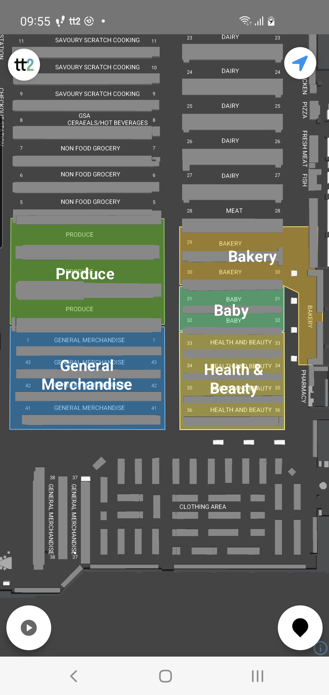
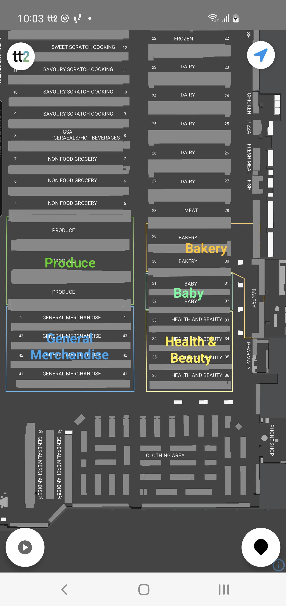
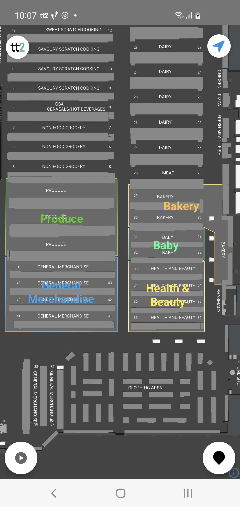
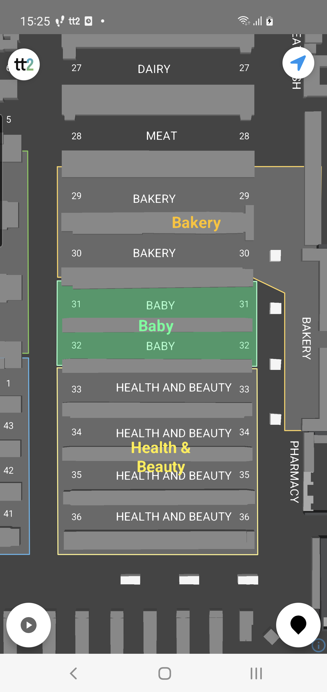

---
# Feel free to add content and custom Front Matter to this file.
# To modify the layout, see https://jekyllrb.com/docs/themes/#overriding-theme-defaults

layout: default
description: Guide to TT2 Android ZoneController.
---

# Zone Controller
### Table of Contents
- [Zone Controller](#zone-controller)
    - [Table of Contents](#table-of-contents)
  - [ZoneController](#zonecontroller)
  - [Summary](#summary)

## ZoneController

Documentation: [ZoneController](https://virtualstores.github.io/tt2/android/tt2-domain/se.virtualstores.tt2_domain.map/-zone-controller/index.html)






<br/><br/>


## Summary

The ZoneController handles the controls for interacting with zones on the map. Zones are created and managed in the CMS where it's possible to set parameters for styling each zone. If no parameters are set for a zone in the CMS it will default to the zone settings in the `MapOptions.zoneStyle`.

```kotlin
// Setting default/fallback zone style options. If zone has styling parameters in the CMS 
// those parameters will override any default settings in MapOptions.zoneStyle()
val mapOptions = MapOptions().apply {
            zoneStyle = MapOptions.ZoneStyle(
                textStyle = MapOptions.TextStyle(textMaxSize = 25f),
                lineStyle = MapOptions.LineStyle(lineColorSelected = MapOptions.parseColor("#FFDB00")),
                fillStyle = MapOptions.FillStyle(colorSelected = MapOptions.parseColor("#FFDB00"), opacity = 0.2f)
            )
        }
```

Zones have three layer components, FillLayer, LineLayer and TextLayer:
 - Fill: The area of the zone.
 - Line: The outline of the zone area.
 - Text: The zone text.

Zones have two states, selected and not selected. Eeach layer component have style parameters for both states.

```kotlin
// Setting default/fallback zone style options. If zone has styling parameters in the CMS 
// those parameters will override any default settings in MapOptions.zoneStyle()
val mapOptions = MapOptions().apply {
            zoneStyle = MapOptions.ZoneStyle(
                textStyle = MapOptions.TextStyle(
                    textColor = MapOptions.parseColor("#00DB00"),
                    textColorSelected = MapOptions.parseColor("#FFDB00")
                ),
                lineStyle = MapOptions.LineStyle(
                    lineColor = MapOptions.parseColor("#00DB00"),
                    lineColorSelected = MapOptions.parseColor("#FFDB00")
                ),
                fillStyle = MapOptions.FillStyle(
                    color = MapOptions.parseColor("#FFDB00"), 
                    colorSelected = MapOptions.parseColor("#FFDB00"), 
                )
            )
        }
```


Below are some examples of zone actions to get you started:

```kotlin

class MyMapFragment: Fragment(), MapListener, ZoneController.Listener {
    
    var mapController: MapController? = null

    override fun onViewCreated(view: View, savedInstanceState: Bundle?) {
        super.onViewCreated(view, savedInstanceState)

        mapController = BaseMapController(
            binding.mapView,
            MapOptions())

        mapController.mapListener = this
        TT2.setMapController(mapController)
    }

    override fun onMapLoaded() {
        super.onMapLoaded()
        
        // access avaliable zones
        mapController.zones?.zones.forEach { zone ->

        }

        // select/deselect a zone to change the apearance of the zone 
        mapController.zones?.select(zone)
        mMapController.zones?.deselect(zone)


        // Show/Hide all zones specific zones
        mapController.zones?.showAll()
        mapController.zones?.hideAll()


        // Show/Hide specific zones
        mapController.zones?.show(zone)
        mapController.zones?.hide(zone)


        // Show/Hide specific zone layers
        mapController.zones?.showFillLayer()
        mapController.zones?.hideFillLayer()

        mapController.zones?.showTextLayer()
        mapController.zones?.hideTextLayer()

        mapController.zones?.showLineLayer()
        mapController.zones?.hideLineLayer()

    }

    override fun onEnter(zone: TT2Zone) {
        
    }

    override fun onExit(zone: TT2Zone) {
        
    }


```
<br/><br/>