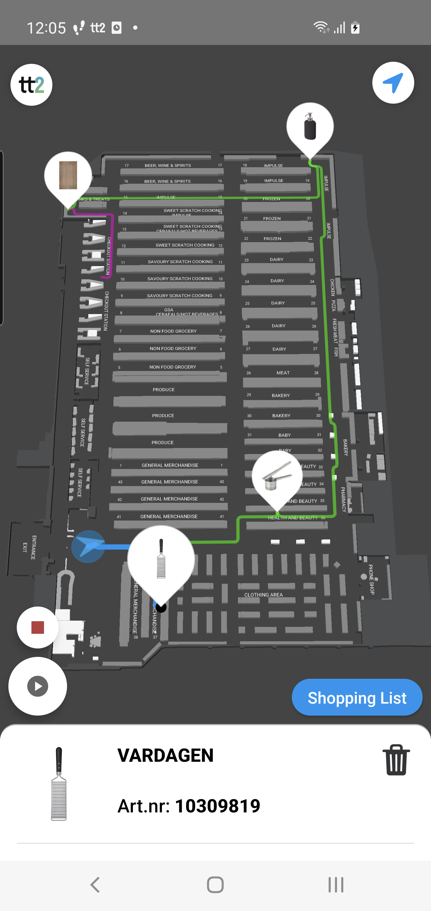
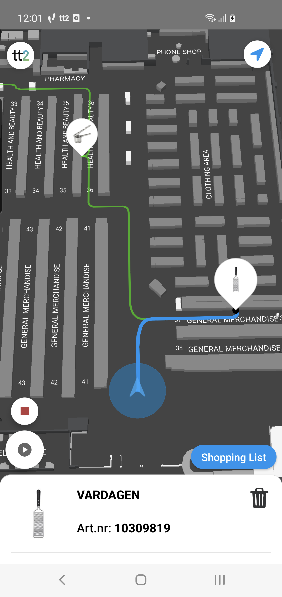
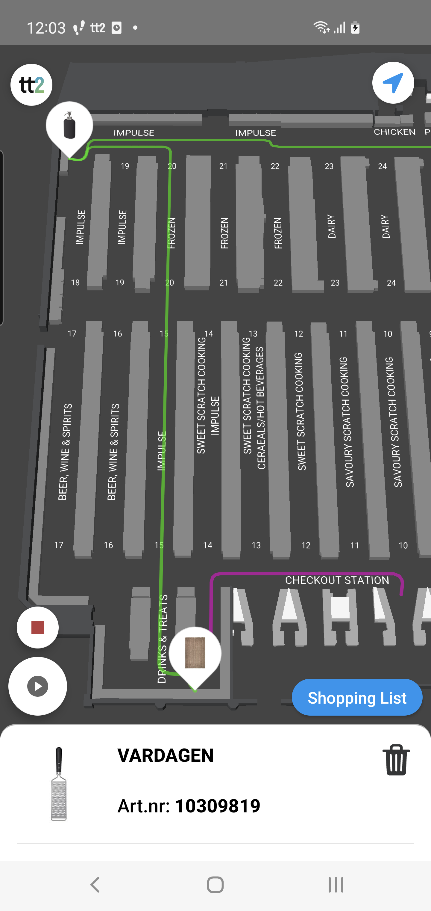

---
# Feel free to add content and custom Front Matter to this file.
# To modify the layout, see https://jekyllrb.com/docs/themes/#overriding-theme-defaults

layout: default
description: Guide to TT2 Android PathfindingController.
---

# Pathfinding Controller
### Table of Contents
- [Pathfinding Controller](#pathfinding-controller)
    - [Table of Contents](#table-of-contents)
  - [Summary](#summary)
    - [PathfindingController](#pathfindingcontroller)
    - [Controlling the path components:](#controlling-the-path-components)

## Summary
The PathfinderController handles the controls for pathfinding to one or several goals on the map.
The common usecase is to use the Pathfinder together with the MarkerController when helping the end user to navigate to a specific item/location. One would then create and place a mark on the item/location position and also create and add a goal on the same position. 

Multiple goals can be added to the pathfinder which will then calculate the shortest route for to each goal and in an order that will result in the shortest overall distance to cover all goals.

In order for the pathfinder to create the optimal route for all goals it uses it's start & end position to know where the end user should end up efter visiting all placed goals. The Start- and EndPosition is set in the CMS.

The calculated path is split into three different components, Head, Body and Tail:
 - Head: The path from the current user position to the current goal.
 - Body: The path from and betwen the current goal and all remaining goals.
 - Tail: The path from the last goal to the pathfinder EndPosition.

The image below shows the different path components. Head=blue, Body=green and Tail=pink

<br/>
<p align="center">



</p>
<br/>

Each path component can be styled independently by overriding the default Pathfinder settings in the MapOptions when setting up the MapController.

Each path component has its own layer and can be switched off with the methods provided by the PathfinderController.

### PathfindingController

Example:
```swift
class ViewController: UIViewController {
  private var cancellable = Set<AnyCancellable>()

  var mapController: IMapController?
	
  override func viewDidLoad() {
    super.viewDidLoad()

    bindPublishers()
  }

  func bindPublishers() {
    mapController?.path.onCurrentGoalChangePublisher
      .compactMap { $0 }
      .sink(receiveValue: { (goal) in
        // Do stuff
      }).store(in: &cancellable)
    mapController?.path.onSortedGoalChangePublisher
      .compactMap { $0 }
      .sink(receiveValue: { (sortedGoals) in
        // Do stuff
      }).store(in: &cancellable)
  }

  func createGoal(id: String, itemPosition: ItemPosition) {
    let goal = PathfindingGoal(id: id, position: itemPosition.point, data: nil, type: .target, floorLevelId: itemPosition.floorLevelId)
    self.mapController?.path.add(goal: goal, completion: { })
  }
}
```

### Controlling the path components:
```swift
func bindPublishers() {
    mapController.mapDataLoadedPublisher
        .sink { (error) in
            // Handle error
        } receiveValue: { [weak self] (loaded) in
            guard loaded else { return }
            // Show the pathfinding components
            self?.mapController.path.showPathfinding()

            self?.// Hide the pathfinding components
            self?.mapController.path.hidePathfinding()

            self?.// Hide specific pathfinding components
            self?.mapController.path.hideTail()
            self?.mapController.path.hideBody()
            self?.mapController.path.hideHead()

            self?.// Show specific pathfinding components
            self?.mapController.path.showTail()
            self?.mapController.path.showBody()
            self?.mapController.path.showHead()
        }.store(in: &cancellable)
}
```