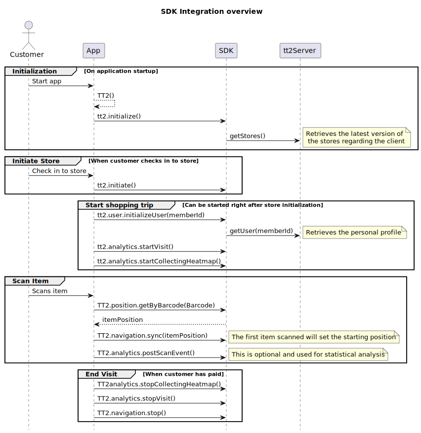
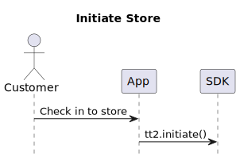
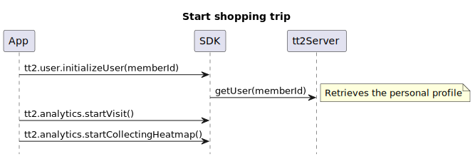
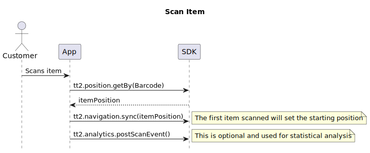
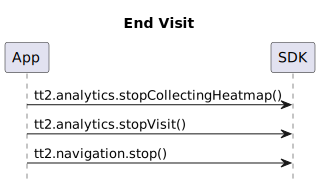

---
# Feel free to add content and custom Front Matter to this file.
# To modify the layout, see https://jekyllrb.com/docs/themes/#overriding-theme-defaults

layout: default
description: This use case shows the TT2 integration flow for a Scan & Go moblie app.
---

# Use case - Mobile Shop & Go
### Table of Contents
- [Use case Mobile Shop & Go](#use-case-mobile-shop--go)
    - [Table of Contents](#table-of-contents)
  - [Overview](#overview)
  - [TT2 Initialization](#tt2-initialization)
  - [Initiate Store](#initiate-store)
  - [Start Shopping Trip](#start-shopping-trip)
    - [Init User Profile](#init-user-profile)
    - [Start Visit](#start-visit)
  - [Scan Item](#scan-item)
  - [End Shopping Trip](#end-shopping-trip)

## Overview

## TT2 Initialization

To get the SDK ready to work first initialize `TT2()` and then call initialize method. This will prepare the SDK for all other purposes. Recomended to save TT2 variable in a singleton so that it will be easily accesible all over the app.



## Initiate Store

When the user chooses a store you can initialize the selected store by calling:



## Start Shopping Trip

### Init User Profile


### Start Visit


## Scan Item



## End Shopping Trip



Alternatively call the convenience method `tt2.stop()` which will do the same as above function
