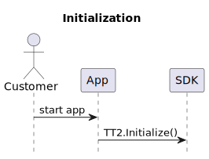

# Use case Mobile Shop & Go
### Table of Contents
- [Use case Mobile Shop \& Go](#use-case-mobile-shop--go)
    - [Table of Contents](#table-of-contents)
  - [Overview](#overview)
  - [TT2 Initialization](#tt2-initialization)
  - [Initiate Store](#initiate-store)
  - [Start Shopping Trip](#start-shopping-trip)
    - [Init User Profile](#init-user-profile)
    - [Start Visit](#start-visit)
  - [Scan Item](#scan-item)
  
## Overview

<p>


## TT2 Initialization


<p>

To get the SDK ready to work first Call initialize method. This will prepare the SDK for all other purposes. 

```kotlin
TT2.initialize(
            context = //applicationContext
            apiUrl = // The api url to connect to
            apiKey = // Your API key
            clientId = //Your client ID
            serviceNotificationIntent =  Intent(context, ClassToReceiveIntent::class.java) // The intent which will be used by the foreground service running the positioning logic, it will also handle user interaction with the notification that will be displayed in the notification center when the app is in background.
        ) { error ->
            if (error != null) {
                // Show error to user in case of any exception happened during initialization including network exception
            } else  {
                // Safe to do the next steps
            }
        }
```

When this step is done, you can get a list of the stores by calling: `TT2.activeStores`

You can show the list of the stores to the user and choose one.

## Initiate Store


<p>

When the user chose a store you can initialize the selected store by calling:

  ```kotlin
  TT2.initStore(
            context = //applicationContext,
            storeId = //Your store Id
            floorLevelId = // (optional) The floor level to start on. If not set the SDK will init the default floorLevel configured in the CMS
        ) { error ->
            if (error != null) {
                // Show error to user in case of any exception happened during initialization including network exception
            } else  {
                // Safe to do the next steps
            }
        }
  ```


## Start Shopping Trip


<p>

### Init User Profile
```kotlin
fun initUser(user: CustomUserObject){
    TT2.userSettings.initializeUserProfile(user.ID) { tt2Profile, tt2NetworkException ->
            // If exception on initialze user profile, we can check if could try this request again
            tt2NetworkException?.let { networkException ->
                // Toast message, handle errors?
                when (networkException) {
                    is TT2NetworkException.NetworkFailureException -> {
                        // optional retry - Create your own retry policy
                        // or - let user shop without positioning
                    }
                    else -> {
                        // no Retry - let user shop without positioning
                        letUserShopWithoutPositioning = true
                    }
                }
            }
​
            // if no exception on userProfile, continue to start visit
            tt2Profile?.let {
                startVisit(user)
            }
        }
    }
}

```
### Start Visit

```kotlin
fun startVisit(user: CustomUserObject) {
    TT2.analytics.startVisit(
        deviceInformation = DeviceInformation(
            operatingSystem = "Android",
            osVersion = Build.VERSION.RELEASE,
            appVersion = BuildConfig.VERSION_NAME,
            Build.MODEL
        ),
        // More tags can be added for more ways of filtering all visits. 
        // We recommended to use these tags as they are already 
        // prepared in the CMS for data filtering.
        tags = mapOf(
            "userID" to user.ID,
            "userGender" to user.gender,
            "userAge" to user.age 
        ),
        metaData = mapOf(
            "customTag" to "customData"
        )
    ) { exception ->
        // If exception on start visit, we can check if we can retry this request
        exception?.let {
            (it as? TT2NetworkException)?.let { networkException ->
                when (networkException) {
                    is TT2NetworkException.NetworkFailureException -> {
                        // optional retry - Create your own retry policy 
                        // or - let user shop without positioning
                    }
                    else -> {
                        //no retry - let user shop without positioning
                    }
                }
            } ?: run {
                // no Retry - let user shop without positioning            
            }
        } ?: run {
            // Exception is null, the user can shop with positioning in the background
            TT2.analytics.startCollectingHeatMapData()
        }
    }
}
```

## Scan Item

<p>

```kotlin
fun onScannedProduct(scannerInputString: String) {
        // if we failed to initiate the analytix or user profile we did not start the navigation, 
        // therefore let's ignore sync on scanned products with a quick return
        if (letUserShopWithoutPositioning)
            return
        
        TT2.position.getByBarcode(scannerInputString) { item ->
            item?.itemPosition?.let { itemPosition ->
                TT2.navigation.syncPosition(
                    itemPosition,
                    syncAngle = false,
                    syncPosition = true,
                    uncertainAngle = true,
                    withForce = false,
                )
​
                // Optionally report the event to track scanning events in the analytics.
                TT2.analytics.postScanEvent(
                    ScanEvent(
                        itemPosition.identifier,
                        itemPosition.shelfId,
                        itemPosition.x,
                        itemPosition.y,
                        System.currentTimeMillis(),
                        ScanEvent.Type.SHELF
                    )
                )
            }
        }
    }
​
```


<embed src="snippet.md" />

